# [ticktock-plus](https://allaafaham.github.io/ticktock-plus)

TickTock+ is a customizable digital clock featuring a timer and stopwatch with an intuitive user interface. Designed for productivity and time management, this application allows users to track time efficiently with various modes and themes. The project is built using HTML, CSS, and JavaScript, ensuring responsiveness and ease of use across different devices.

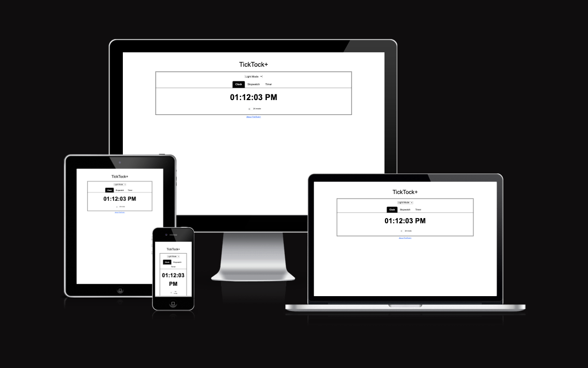

source: [ticktock-plus amiresponsive](https://ui.dev/amiresponsive?url=https://allaafaham.github.io/ticktock-plus)

> [!IMPORTANT]
> The examples in these templates are strongly influenced by the Code Institute walkthrough project called "Love Maths".

## UX

### The 5 Planes of UX

#### 1. Strategy Plane
##### Purpose
- Provide users with a sleek and customizable time-tracking tool.
- Allow users to switch between a clock, timer, and stopwatch seamlessly.
- Enhance user experience with multiple visual themes.

##### Primary User Needs
- View a real-time digital clock.
- Use a stopwatch with lap functionality.
- Set a countdown timer with pause, resume, and reset features.
- Customize the appearance with different themes.

##### Business Goals
- Improve time management for users.
- Encourage engagement through customization options.

#### 2. Scope Plane
##### Features
- A full list of [Features](#features) can be viewed in detail below.

##### Content Requirements
- Instructions on using the stopwatch, timer, and clock features.
- Clear labels and instructions for input and buttons.

#### 3. Structure Plane
##### Information Architecture
- **Navigation Menu**:
  - Links to Clock, Timer, Stopwatch
- **Hierarchy**:
  - Theme settings prominently accessible for user customization.
   - Clear and prominent placement of the input field and  buttons.

##### User Flow
1. User lands on the home page → sees the digital clock.
2. Navigates to the stopwatch and starts tracking laps.
3. Switches to the timer and sets a countdown with a sound alert.
4. Adjusts the theme in settings for a personalized experience.
5. Navigates to the About section to read about the website.

#### 4. Skeleton Plane
##### Wireframe Suggestions
- A full list of [Wireframes](#wireframes) can be viewed in detail below.

#### 5. Surface Plane
##### Visual Design Elements
- **[Colours](#colour-scheme)**: see below.
- **[Typography](#typography)**: see below.

### Colour Scheme

TickTock+ offers multiple themes for a personalized experience:

- Light Mode: Default white background with dark text.

- Dark Mode: Black background with white highlights.

- Cyber Mode: Neon colors and a futuristic font.

- Retro Mode: Classic digital clock aesthetics.

### Typography

- The Font Arial was used for the light and dark modes.

- The Font Orbitron was used for the cyber mode.

- The Font Press Start 2P was used for the retro mode.

## User Stories

| Target | Expectation | Outcome |
| --- | --- | --- |
| As a user | I want to see the current time displayed in a clear and readable format | so that I can check the time easily. |
| As a user | I want a stopwatch function that can start, stop, and reset | so that I can track elapsed time. |
| As a user | I want a countdown timer where I can set a specific duration, start, pause, and reset it | so that I can use it for tasks. |
| As a user | I want a simple and intuitive interface | so that I can use the clock, timer, and stopwatch without confusion. |
| As a user | I want to customize the clock's appearance (e.g., dark mode) | so that it matches my preferences. |
| As a user | I want the stopwatch to record lap times | so that I can track multiple intervals. |
| As a user | I want sound or visual alerts when the countdown timer reaches zero | so that I know when time is up. |
| As a user | I want the clock to display time in both 12-hour and 24-hour formats | so that I can choose my preferred time format. |
| As a user | I want an option to set multiple timers at once | so that I can track different tasks simultaneously. |

## Wireframes

To follow best practice, wireframes were developed for mobile, tablet, and desktop sizes.
I've used [Balsamiq](https://balsamiq.com/wireframes) to design my site wireframes.

| Page | Mobile | Tablet | Desktop |
| --- | --- | --- | --- |
| Home | 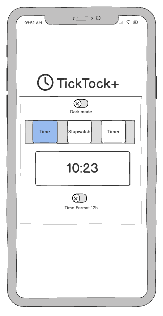 | 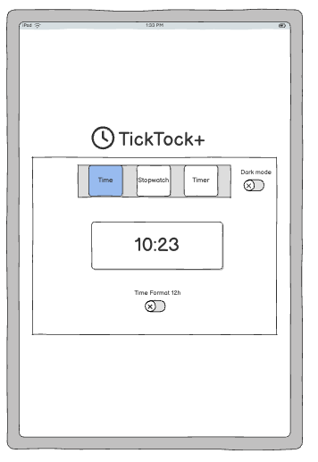 | 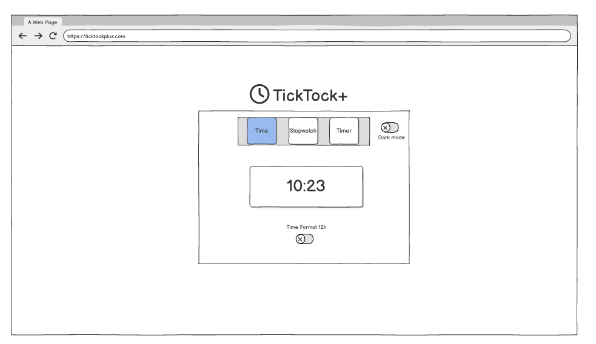 |

## Features

### Existing Features
| Feature | Notes | Screenshot |
| --- | --- | --- |
| Clock | The clock displays the current time in a clear and readable format. Users can choose between 12-hour and 24-hour formats for their preference. | 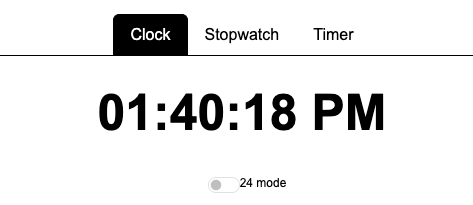 |
| Stopwatch | The stopwatch includes start, stop, and reset functionality. Users can track elapsed time, with the option to record lap times as well. | 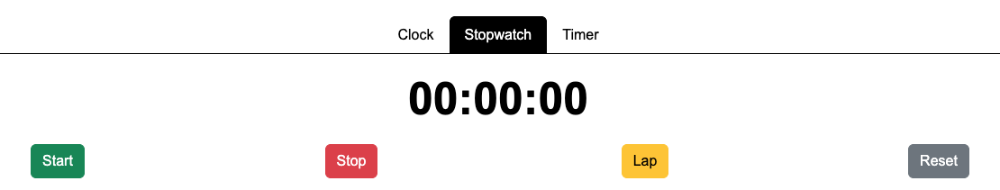 |
| Timer | The timer allows users to set specific durations for tasks, with start, pause, and reset options. Users can also set multiple timers at once. | 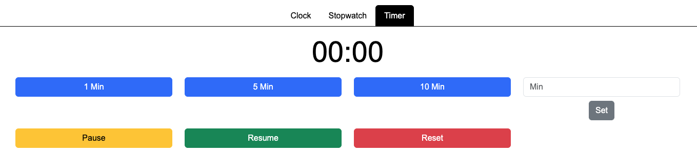 |
| Customization | Users can switch between themes (White, Dark, Cyber, Retro) to personalize the look and feel of the app. This provides a visually pleasing experience based on the user's preferences. | 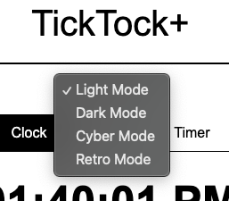 |
| About Page | A link is provided beneath the main content box that redirects users to an about page with information about the app and its features. | 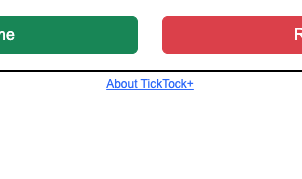 |

### Future Features

- **Stopwatch with Interval Training**: Enable users to set specific time intervals (e.g., 5 minutes work, 1-minute break) for workout sessions, studying, etc. Visual or audio cues when intervals end.
- **Timer Notifications**: Users can set specific notifications when the timer reaches certain milestones (e.g., 1 minute remaining, halfway point), making it more interactive.
- **Multiple Clocks**: Enable users to display multiple clocks for different time zones, useful for people working with international teams or with family in other regions.
- **Countdown Sound Effects**: Let users select different sound effects for the countdown timer, creating a more immersive experience with audio cues.

## Tools & Technologies

| Tool / Tech | Use |
| --- | --- |
|  | Generate README and TESTING templates. |
|  | Version control. (`git add`, `git commit`, `git push`) |
|  | Secure online code storage. |
|  | Local IDE for development. |
|  | Main site content and layout. |
|  | Design and layout. |
|  | User interaction on the site. |
|  | Hosting the deployed front-end site. |
|  | Creating wireframes. |

## Agile Development Process

### GitHub Projects

[GitHub Projects](https://www.github.com/allaafaham/ticktock-plus/projects) served as an Agile tool for this project. Through it, EPICs, User Stories, issues/bugs, and Milestone tasks were planned, then subsequently tracked on a regular basis using the Kanban project board.

### GitHub Issues

[GitHub Issues](https://www.github.com/allaafaham/ticktock-plus/issues) served as an another Agile tool. There, I managed my User Stories and Milestone tasks, and tracked any issues/bugs.

| Link | Screenshot |
| --- | --- |
|  | 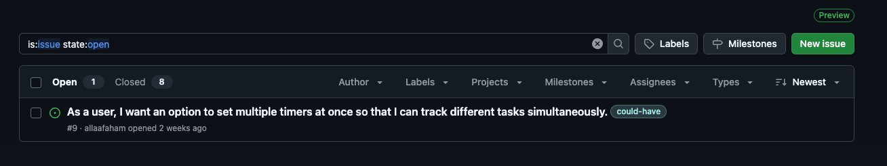 |
|  | 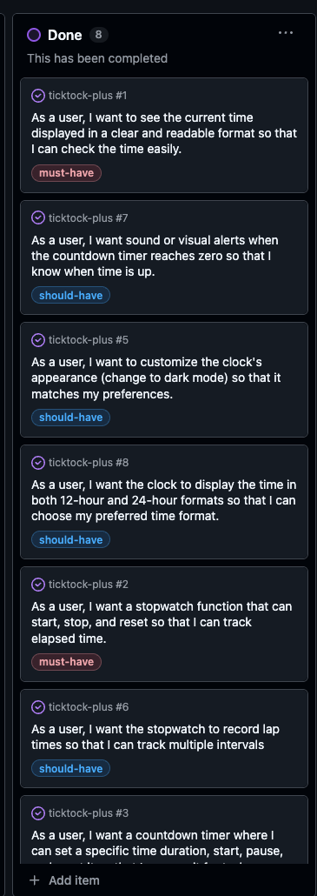 |

### MoSCoW Prioritization

I've decomposed my Epics into User Stories for prioritizing and implementing them. Using this approach, I was able to apply "MoSCoW" prioritization and labels to my User Stories within the Issues tab.

- **Must Have**: guaranteed to be delivered - required to Pass the project (*max ~60% of stories*)
- **Should Have**: adds significant value, but not vital (*~20% of stories*)
- **Could Have**: has small impact if left out (*the rest ~20% of stories*)

## Testing

> [!NOTE]
> For all testing, please refer to the [TESTING.md](TESTING.md) file.

## Deployment

### GitHub Pages

The site was deployed to GitHub Pages. The steps to deploy are as follows:

- In the [GitHub repository](https://www.github.com/allaafaham/ticktock-plus), navigate to the "Settings" tab.
- In Settings, click on the "Pages" link from the menu on the left.
- From the "Build and deployment" section, click the drop-down called "Branch", and select the **main** branch, then click "Save".
- The page will be automatically refreshed with a detailed message display to indicate the successful deployment.
- Allow up to 5 minutes for the site to fully deploy.

The live link can be found on [GitHub Pages](https://allaafaham.github.io/ticktock-plus).

### Local Development

This project can be cloned or forked in order to make a local copy on your own system.

#### Cloning

You can clone the repository by following these steps:

1. Go to the [GitHub repository](https://www.github.com/allaafaham/ticktock-plus).
2. Locate and click on the green "Code" button at the very top, above the commits and files.
3. Select whether you prefer to clone using "HTTPS", "SSH", or "GitHub CLI", and click the "copy" button to copy the URL to your clipboard.
4. Open "Git Bash" or "Terminal".
5. Change the current working directory to the location where you want the cloned directory.
6. In your IDE Terminal, type the following command to clone the repository:
	- `git clone https://www.github.com/allaafaham/ticktock-plus.git`
7. Press "Enter" to create your local clone.

Alternatively, if using Gitpod, you can click below to create your own workspace using this repository.

**Please Note**: in order to directly open the project in Gitpod, you should have the browser extension installed. A tutorial on how to do that can be found [here](https://www.gitpod.io/docs/configure/user-settings/browser-extension).

#### Forking

By forking the GitHub Repository, you make a copy of the original repository on our GitHub account to view and/or make changes without affecting the original owner's repository. You can fork this repository by using the following steps:

1. Log in to GitHub and locate the [GitHub Repository](https://www.github.com/allaafaham/ticktock-plus).
2. At the top of the Repository, just below the "Settings" button on the menu, locate and click the "Fork" Button.
3. Once clicked, you should now have a copy of the original repository in your own GitHub account!

### Local VS Deployment

There are no remaining major differences between the local version when compared to the deployed version online.

## Credits

### Content

| Source | Notes |
| --- | --- |
| [Markdown Builder](https://markdown.2bn.dev) | Help generating Markdown files |
| [Love Maths](https://codeinstitute.net) | Code Institute walkthrough project inspiration |
| [ChatGPT](https://chatgpt.com) | Help with code logic and explanations |

### Media

| Source | Notes |
| --- | --- |

### Acknowledgements

- I would like to thank my Code Institute mentor, [Tim Nelson](https://www.github.com/TravelTimN) for the support throughout the development of this project.
- I would like to thank the [Code Institute](https://codeinstitute.net) Tutor Team for their assistance with troubleshooting and debugging some project issues.
- I would like to thank the [Code Institute Slack community](https://code-institute-room.slack.com) for the moral support; it kept me going during periods of self doubt and impostor syndrome.
