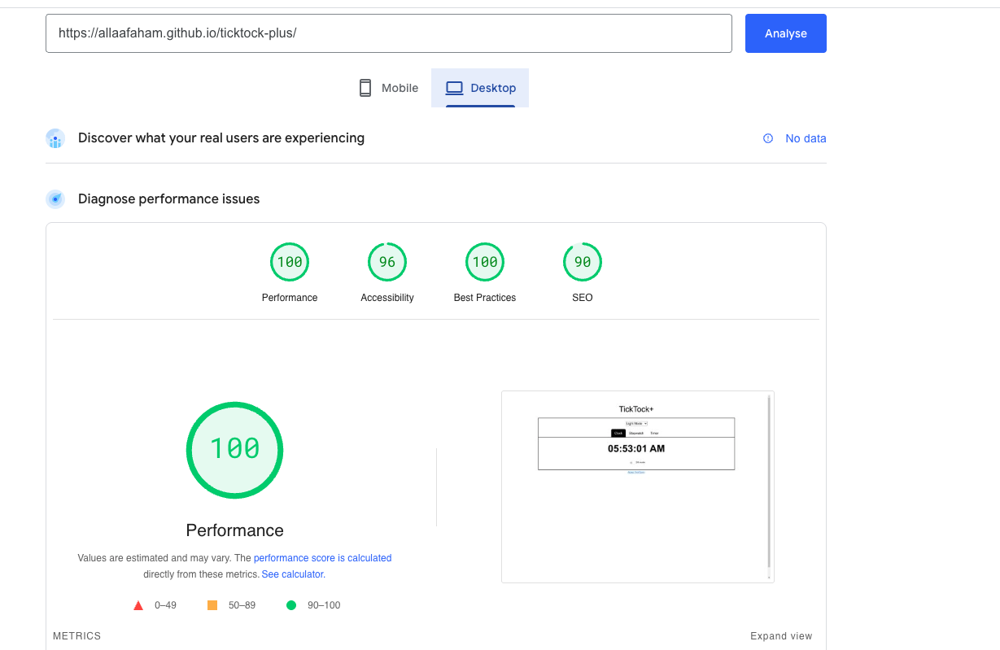

# Testing

> [!NOTE]
> Return back to the [README.md](README.md) file.

## Code Validation

### HTML

I have used the recommended [HTML W3C Validator](https://validator.w3.org) to validate all of my HTML files.

| Directory | File | URL | Screenshot |
| --- | --- | --- | --- |
|  | [404.html](https://github.com/allaafaham/ticktock-plus/blob/main/404.html) | [HTML Validator](https://validator.w3.org/nu/?doc=https://allaafaham.github.io/ticktock-plus/404.html) |  | 
|  | [about.html](https://github.com/allaafaham/ticktock-plus/blob/main/about.html) | [HTML Validator](https://validator.w3.org/nu/?doc=https://allaafaham.github.io/ticktock-plus/about.html) |  | 
|  | [index.html](https://github.com/allaafaham/ticktock-plus/blob/main/index.html) | [HTML Validator](https://validator.w3.org/nu/?doc=https://allaafaham.github.io/ticktock-plus/index.html) |  |

### CSS

I have used the recommended [CSS Jigsaw Validator](https://jigsaw.w3.org/css-validator) to validate all of my CSS files.

| Directory | File | URL | Screenshot | Notes |
| --- | --- | --- | --- | --- |
| assets | [style.css](https://github.com/allaafaham/ticktock-plus/blob/main/assets/css/style.css) | [CSS Validator](https://jigsaw.w3.org/css-validator/validator?uri=https://allaafaham.github.io/ticktock-plus) |  | Notes (if applicable) |

### JavaScript
I have used the recommended [JShint Validator](https://jshint.com) to validate all of my JS files.

| Directory | File | URL | Screenshot | 
| --- | --- | --- | --- |
| assets | [script.js](https://github.com/allaafaham/ticktock-plus/blob/main/assets/js/script.js) | N/A |  |

## Responsiveness

I've tested my deployed project to check for responsiveness issues.

| Page | Mobile | Tablet | Desktop | Notes |
| --- | --- | --- | --- | --- |
| index |  |  |  | Works as expected |

404 and about pages are contain only simple text.

## Browser Compatibility

I've tested my deployed project on multiple browsers to check for compatibility issues.

| Page | Chrome | Firefox | Safari | Notes |
| --- | --- | --- | --- | --- |
| Home |  |  |  | Works as expected |

404 and about pages are contain only simple text.

## Lighthouse Audit

I've tested my deployed project using the Lighthouse Audit tool to check for any major issues. Some warnings are outside of my control, and mobile results tend to be lower than desktop.

| Page | Mobile | Desktop |
| --- | --- | --- |
| Home |  |  |

## User Story Testing
| Target | Expectation | Outcome | Pass |
| --- | --- | --- | --- |
| As a user | I want to see the current time displayed in a clear and readable format  | so that I can check the time easily. | x |
| As a user | I want a stopwatch function that can start, stop, and reset | so that I can track elapsed time. | x |
| As a user | I want a countdown timer where I can set a specific time duration, start, pause, and reset it  | so that I can use it for tasks. | x |
| As a user | I want a simple and intuitive interface | so that I can use the clock, timer, and stopwatch without confusion. | x |
| As a user | As a user, I want to customize the clock's appearance (change to dark mode) | so that it matches my preferences. | x |
| As a user | I want the stopwatch to record lap times | so that I can track multiple intervals. | x |
| As a user | I want sound or visual alerts when the countdown timer reaches zero | so that I know when time is up. | x |
| As a user | I want the clock to display the time in both 12-hour and 24-hour formats | so that I can choose my preferred time format. | x |
| As a user | I want an option to set multiple timers at once | so that I can track different tasks simultaneously. | in the Future |

> [!IMPORTANT]
> There are no remaining bugs that I am aware of, though, even after thorough testing, I cannot rule out the possibility.

